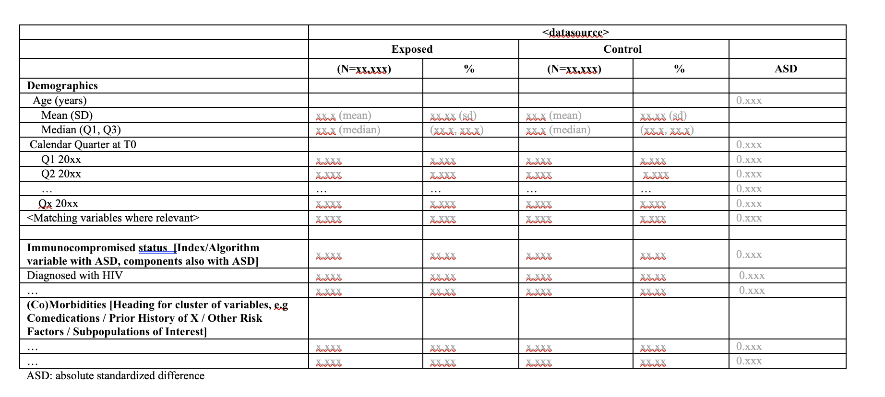

```{r, include = FALSE}
knitr::opts_chunk$set(
  collapse = TRUE,
  comment = "#>"
)
```

**DescriptiveTable** is an R package for creating tables of baselines descriptives (sometimes referred to as 'Table 1' in epidemiological research settings). The package is developed and maintained by the Real World Evidence (RWE) research group at UMCU. 

The inputs required are:
1) a dataset with rows equal to units from one or more groups, and columns equal to covariates (with a group identifier)
2) a metadata file defining the output table; which variables should be included, if any nesting of counts should be done, what information should be displayed, what text labels each variable should have

Based on these inputs, `DescriptivesTable()` outputs a baseline descriptives table: A table describing, for one or more groups, descriptive statistics such as cell counts, means, medians and quantiles, for a list of different covariates. These tables typically are used to characterize the covariate distribution in a population, or describe differences in covariate distributions between two groups. 

```{r pressure, echo=FALSE, fig.cap="A caption", out.width = '100%'}

```

Although multiple packages exist for creating such tables, this package was developed to incorporate a variety of specific needs for RWE, such as:
1) The calculation of **absolute standardized differences** (ASDs) to compare variables of different types across groups (using the `stddiff` package)
2) The calculation of **weighted** ASDs (using, e.g., IPT weights) using custom functions
3) **Masking** of cell counts smaller than a pre-specific integer to comply with privacy regulations
4) Specification of different nesting structures, headings and display names using a flexible **metadata** format
5) Wrangling of large datasets using `data.table`

# Using the package

## Installation and Dependencies

To use the package the best way is to pull the last version, then open the R project and run the following code in the console:

```{r, eval = F}
devtools::install()
```

This should install the package locally, so you can then load normally:

```{r}
library(DescriptiveTable)
```

Alternatively, if you have set up an authenticator for your github account in Rstudio, you can use:

```{r, eval = F}
devtools::install_github("UMC-Utrecht-RWE/DescriptiveTable")
```

There are currently three main packages on which `DescriptiveTable` depends.
 - `stddiff` provides functions for computing (unweighted) ASDs
 - `data.table` is the basis for how the input datasets are manipulated
 - `stringr` is used internally for regular expressions


```{r dependencies}
require(stddiff)
require(data.table)
require(stringr)
```

## Inputs

The inputs required are:
1) a dataset with rows equal to units from one or more group, and columns equal to covariates (with a group identifier)
2) a metadata file defining the output table; which variables should be included, if any nesting of counts should be done, what information should be displayed, what text labels each variable should have

In addition to these two required inputs, there are a number of optional inputs which we will describe.

### Covariate Dataset

The main input is a dataset containing information on different covariates. Each row of this dataset is treated as a seperate unit. The columns define the covariates to be described in the output table, and an identifier column for group membership. An example is included in the R package for your use, with a large number of columns for testing purposes

```{r}
# read dataset of interest
popdf <- readRDS(
  system.file("extdata/example/", "example_cohort_dataset.rds", package = "DescriptiveTable"))
head(popdf[,1:7])
```

### Metadata

`DescriptiveTable` uses a metadata file to specify the desired output. The metadata file contains one row per variable to be included in the table, in order of display, and defines the following columns:
  - `var` the name of the variable (column) in the input covariate dataset
  - `type` determines how the input variable is treated - how the ASD is computed, and what type of information is displayed. The options are `TF` (binary, true/false, count for TRUE displayed), `CAT` (categorical), `NUM1` (numeric, display mean and SD on one row, median Q1 and Q3 on second) or `NUM2` (numeric, display median Q1 Q3 on one row, min-max on second).
  - `expectedCat` defines which category values should be displayed in the table. Can be a string listing category values of interest, or a string of format `get <object_name>` where `<object_name>` is a vector in the global environment containing all category valeus to be listed.
  - `label` what display name to give this variable.
  - `parent` and `parent_cat` defines the denominator for cell counts. By default, `parent = NA` means the overall table total is used as a denominator. Otherwise a parent `var` name must be specified, with a corresponding parent variable category.
  - `header` defines an optional header string to be displayed before this variable, for instance, if a cluster of related variables are to be displayed
  
An example with a variety of input options specified is provided in the package `extdata` folder.

```{r}
# load specification of the table
# "parent" variables and categories determine the denominator used to compute percentages for that variable
table_metadata <- fread(
  system.file('extdata/example/', 'BaselineDescriptives_metadata.csv', package = 'DescriptiveTable'))
```

As we can see from the example metadata, we have an `expectedCat` entry which points to a global object called `study_quarters_all`. To run the example code, we need to specify any such objects in the global environment

```{r}
# global parameters (interact with get() in table metadata)
study_quarters_all <- c("2021 Q1",
"2021 Q2",
"2021 Q3",
"2021 Q4",
"2022 Q1",
"2022 Q2",
"2022 Q3",
"2022 Q4",
"2023 Q1")

```

### Optional inputs

Two additional optional inputs, which can be passed as vectors to the `DescriptivesTable` function, are of note. The first of these is a lookup table or dictionary, which maps integer values of **categorical** variables in the dataset to meaningful labels to be displayed in the table. An example is supplied
```{r}
# load helper information value-labels of categorical variables
label_lookup <- readRDS(
  system.file("extdata/example/", "label_lookup.rds", package = "DescriptiveTable"))

label_lookup[4:9,]
```

A second piece of information which can be supplied is a vector which defines which variables should be treated as missing. For this it is important to remember that scripts may be deployed in different data-access providers, some of whom may not have access to all of the study variables of interest. For instance, one DAP may not have access to smoking behaviour, while another does. For consistency sake, the input dataset for both DAPs may contain a column reflecting the smoking study variable, but this will be filled with dummy (0) values for the DAP in which this variable is not measured. To work around this we may load an additional metadata file and pass relevant information to the function

```{r}
# settings
DAP <- "TEST1"

# load helper information on what variables are expected to be missing in the DAP
ExpectedMissingVars <- data.table::fread(
    system.file("extdata/example/", "ExpectedMissingVariables.csv", package = "DescriptiveTable"))
ExpectedMissingVars <- ExpectedMissingVars[get(DAP) %in% TRUE, VarName]

```

## Create Baseline Descriptive tables

The function `DescriptivesTable()` creates a baseline descriptives table, stratified by a grouping variable. Here, we illustrate its use with the example inputs specified above. You can check function options by typing ?DescriptivesTable in the R console.

```{r, eval = FALSE}
# create table
tableout <- DescriptivesTable(popdf = popdf,# data object
                  table_metadata = table_metadata, # specification of table
                  groupcol = "group", # name of column in which group membership (e.g. exposed vs control) can be found
                  output_format = "processed" ,# "processed" or "raw"; raw for debugging only, outputs at earlier step
                  calculate_asd = TRUE, # option; calculate ASD and add to table or not
                  keep_varinfo = TRUE, # FALSE keeps only the end-labels, TRUE also outputs var names etc.
                  label_lookup = label_lookup,
                  missing_vars = ExpectedMissingVars,
                  missing_flag = -99, # numeric flag for missing variables
                  round_decimals = 2, # to how many decimal places should be rounded
                  output_asd = FALSE
)

print(tableout[,c("label",paste0("V", 1:3,"_EXPOSED"), paste0("V",1:3,"_CONTROL"), "asd_1")])

# explanation of what the column names mean
# setnames(tableout,c(paste0("V",1:3,"_EXPOSED"), paste0("V",1:3,"_CONTROL")),
#         c("N_exposed","perc_exposed","aux_exposed",
#           "N_control","perc_control","aux_control")
# )
```

Notice that the table contains all of the numeric information we need, but that the table would still need to be processed for aesthetics to be "report-ready". We do not currently have functionality developed for this post-processing (merging columns, changing column names, adding indents, dropping unneeded columns etc.). 

The remainder of this readme will examine additional tools and operations in the package.

## Apply masking

Masking refers to the process of replacing true cell values with some alternative value. Typically we aim to mask sub-category counts below a certain threshold, very often 5. The information which replaces cell values less than 5 is an interval 1-4. 

A wrapper function mask_vector_wrapper applies the masking function to all relevant columns of the descriptive table. Here, we illustrate its use with a threshold of 5. You can check function options by typing ?mask_vector_wrapper in the R console. The function takes care of masking of subcategory values when the total is known. The input is the table outputted above.

The wrapper is built on top of the function mask_vector, which can be used to mask individual vectors. You can check function options by typing ?mask_vector in the R console.


```{r, eval = FALSE}
# Aplly masking
tableout_masked <- mask_vector_wrapper(tableout = tableout, threshold = 5,
                                table_metadata = table_metadata,
                                count.names = c('V1_CONTROL', 'V1_EXPOSED'),
                                pct.names = c('V2_CONTROL', 'V2_EXPOSED'),)

print(tableout_masked[c(1:5, 97:101),c("label",paste0("V", 1:3,"_EXPOSED"), paste0("V",1:3,"_CONTROL"), "asd_1")])
```

We would always recommend to compare the original and masked tables to ensure that masking has been applied correctly, and to check for possible bugs. The function status should be considered experimental.

```{r, eval = FALSE}
# Compare both tables
waldo::compare(tableout,tableout_masked)
```

This are other things that are worth exploring with the table
```{r, eval = FALSE}
# # for clarity, this is what V1-V3 represent


# # ---- other functionality/ things to note 
# optional; re-arranging of columns to sensible order
tableout[,c("label",paste0("V",1:3,"_EXPOSED"), paste0("V",1:3,"_CONTROL"))]


# ----- basic post-processing -----

# optional masking rules implemented in seperate functions
 # round_to; round to decimal places as chr. string, return <0 if resulting numeric zero
# sapply(tableout$perc_control, function(s) round_to(s,2))
```

## Extended example

